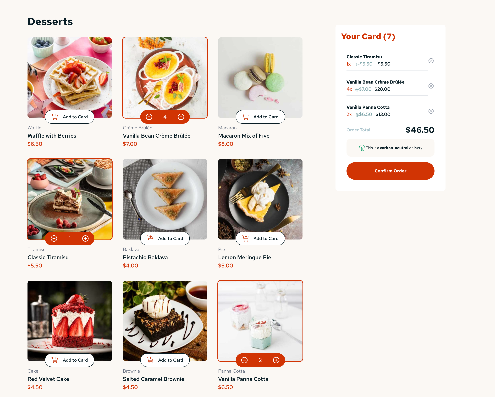

# 🍰 Dessert Store

This is a modern and responsive Dessert Store built using **React, Redux, and Tailwind CSS**. The application allows users to browse desserts, add them to the cart, and place orders in an intuitive and visually appealing UI.

## 🚀 Features

- 📦 **Add to Cart** functionality with Redux state management.
- 🎨 **Modern UI** designed with Tailwind CSS.
- 🔄 **Real-time Cart Updates** with item count and total price.
- 📱 **Fully Responsive** for mobile and desktop.
- ⚡ **Fast & Smooth** thanks to React's optimized rendering.

## 🛠️ Technologies Used

- **React** (Component-based architecture)
- **Redux** (Global state management)
- **Tailwind CSS** (Utility-first styling)

## 📷 Preview

## 📦 Installation

To run this project locally, follow these steps:

1. Clone the repository:
2. Install dependencies:
   npm install
3. Start the development server:
   npm run dev

# 🎯 Future Improvements

🛒 Backend integration for real orders.
🌍 Multi-language support.
💳 Payment gateway integration.

# 🔗 Credits

This project is based on a challenge from [Frontend Mentor](https://www.frontendmentor.io). The original design and concept belong to them, and this implementation was built using React, Redux, and Tailwind CSS.

# 📜 License

This project is licensed under the MIT License. If you use this project, please ensure you credit [Frontend Mentor](https://www.frontendmentor.io) for the original design.

# 🌟 Show Your Support!

If you like this project, please ⭐️ the repository to help it grow!
